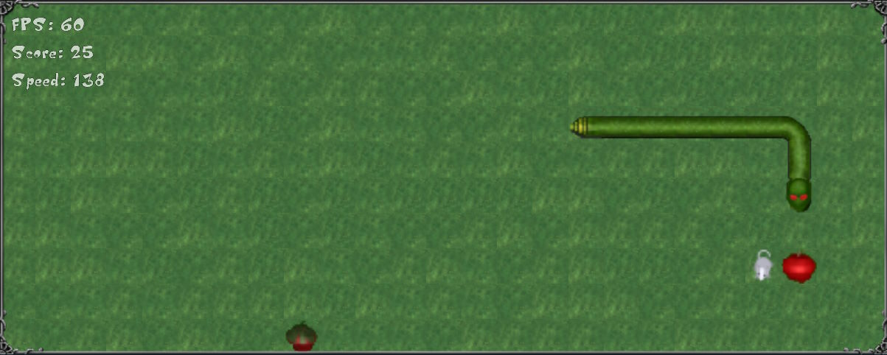

# serpents2r 🐍

Serpents 2 Respawned - a snake like game. A remaster of a very old similar game.

## Play online ⚽

Play the github pages build <https://dezgusty.github.io/serpents2r/>

## About the game

The game is written in Typescript using `pixi.js`, `Vite`.

Start the game and try to obtain as many points as possible.

Input control:

- ⌨️ Keyboard: Directional Keys (or WASD) for directions, SPACE for paus
- 🎮 Gamepad: Directional stick for directions
- 📱 Touchscreen devices: On-screen controls appear after touch

Resources:

- Game art (2D)
  - some created by me
  - some used from  [Kenney](https://kenney.nl/)
  - mouse sprite generated using gen-ai (<https://creator.nightcafe.studio/>)
- Sounds
  - some created by me
  - some used from  [Kenney](https://kenney.nl/)
- Music
  - AI generated via [Suno](https://suno.com/)

## For developers

For details on building, see also [doc/building.md](./doc/building.md).
